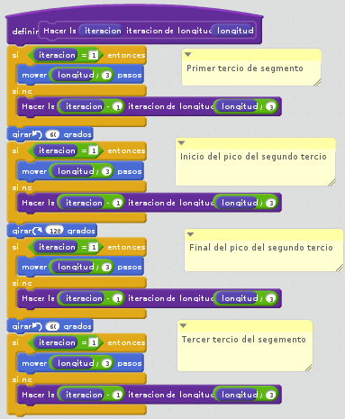

========================
Actividades de Funciones
========================
En este bloque se agrupan aquellas actividades relacionadas con las funciones
   
Programando Fractales
======================

**Material necesario:** Impresora 3D o Scratch. cabezal de Plotter para transformar la impresora en una máquina de dibujar

En esta actividad vamos a dibujar el Fractal de Koch:

Para programar el *fractal de Koch*, tenemos que realizar un proceso recursivo, de manera que cuántas más veces iteremos la recursividad mayor nivel de detalle obtendremos.

    
    (detalle de la función *linea_koch*)
    
.. code-block:: python

        import image  
 