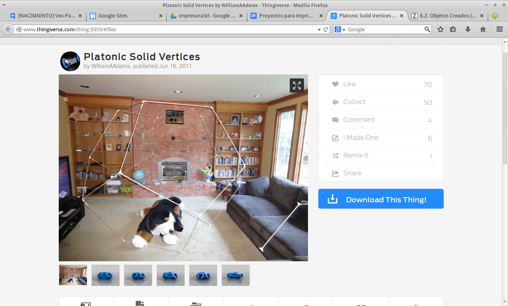
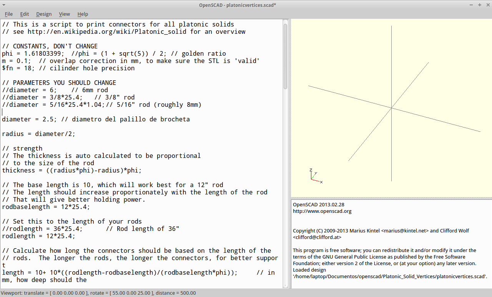
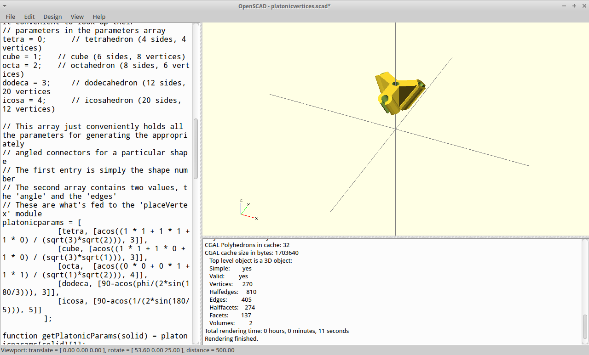
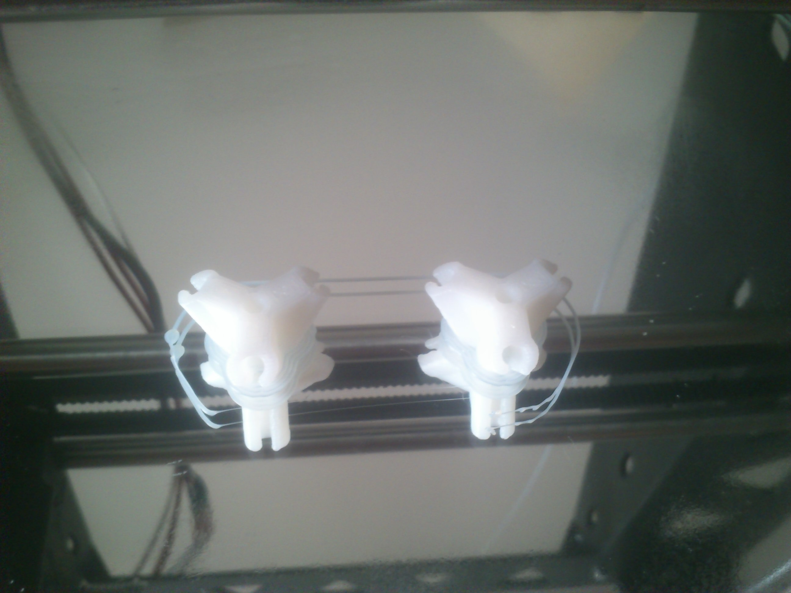
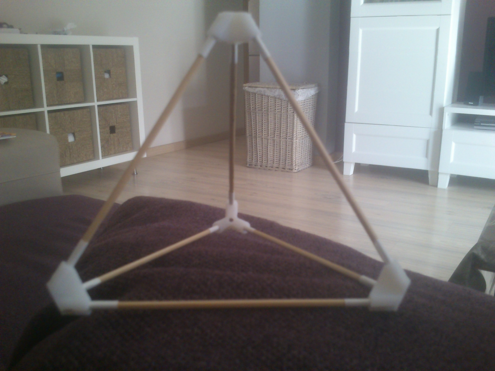

========================
Actividades de Geometría
========================
En este bloque se agrupan aquellas actividades relacionadas con geometría

Poliedros Regulares
===================

Material necesario: Impresora 3D, palillos de brocheta.

En esta actividad vamos a crear los poliedros regulares con la ayuda de piezas impresas y palillos de brochetas.

Para saber la cantidad de vértices y de aristas (piezas impresas y palillos), podemos ayudarnos de la fórmula de Euler:

C-A=V+2
(fuente y más información: http://gaussianos.com/la-formula-de-euler-una-maravilla-matematica/)

Un ejercicio que puede estar bien es, calcular los vértices, caras y aristas imaginándonos los poliedros mentalmente. El tetraedro, por su prefijo, tiene cuatro caras. Si nos imaginamos una cara apoyada sobre el suelo, al ser triangular, tendrá 3 vértices. La punta que queda en alto, nos daría el cuarto vértice.

La suma de caras y vértices sería 4+4=8.

The area of a circle is :math:`A_\text{c} = (\pi/4) d^2`. 

ejercicio: :math:\frac{x^{2}}{y^{3}} `A_\text{c} = (\pi/4) d^2`.

Por lo tanto, de la fórmula de Euler, obtenemos que las aristas han de ser 6.

Entonces, necesitamos 6 palillos si queremos hacer un tetraedro

Lo siguiente será determinar la anchura de los palillos que hayamos comprado

Con el calibre podemos medir la anchura:

.. figure:: ./images/poliedros_calibre.jpg
    :scale: 10 %
    
En mi caso, mide 2.5 mm.  

Lo siguiente es generar el fichero `stl` que nos permitirá imprimir los vértices:

En thingiverse podemos encontrar los vértices parametrizables para el poliedro que queramos y para el grosor de la arista que queramos (fuente: http://www.thingiverse.com/thing:9359/):

    
    
De los ficheros que aparecen para descargar nos interesa el de extensión scad.

El fichero de extensión scad, es el que nos va a permitir parametrizar los vértices a nuestro gusto.
Para ello, abrimos el fichero con OpenScad y se modifica el grosor:

    
Tenemos que añadir una línea en la que ponga diameter = 3.4; . Nota: En la foto aparece 2.5, pero con ese valor sale una pieza muy pequeña.

Un poco más abajo podemos parametrizar qué poliedro vamos a imprimir, para ello descomentamos (quitamos los //) en la línea que pone: placevertex(getPlatonicParams(tetra)); 
   
.. image:: ./images/poliedros_openscad_2.png
    :width: 20000 px   

Sólo nos queda compilara y renderizar (F6). Con esto obtendremos nuestro objeto en la parte de la derecha de la pantalla:
   

Paso 4: Imprimir los vértices y montar:

Detalle de dos vértices impresos:

      
El tetraedro montado:
a    

   
    
    
   
    
    

