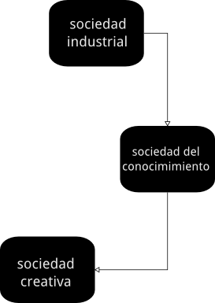

============
Introducción
============

Son muchas las razones que me han llevado a elaborar la siguiente compilación de actividades creativas. 
La principal razón es la de poder aportar a quién esté interesado  Éstas podrán ser llevadas o no a un aula de secundaria, pero todas han sido prensadas con ese objetivo.
Como profesor de matemáticas que soy, muchas de estas actividades se han enfocado para complementar dicha asigantura. Sin embargo, estoy convencido que el lector podrá modificarlas para adaptarlas a sus necesidades. 

.. note::
	Esta documentación puede ser leida en el orden que se quiera, usted es libre de elegir qué actividades le interesan

Desarrollando la creatividad del alumno
_______________________________________

Pedagógicamente considero que fomentar la creatividad del alumnado es un esfuerzo que merece la pena.

Algunas ventajas de ser "creativo", bajo mi humilde opinión serían:
 
	- Nos permite seguir siendo "niños"
	- Ayuda a construir personas proactivas y con iniciativa
	- Ayuda a desarrollar el pensamiento crítico
	- Desarrollar una competencia demandada por el sistema productivo actual
	
El fomento de la creatividad en el alumnado constituye una potente herramienta de aprendizaje.
Crear un libro, un dibujo, un canción, una coreografía o un corto pueden ser excelentes maneras de no sólo adquirir conocimiento, sino también de desarrollar el espíritu crítico. 
Hasta ahora la tecnología e internet nos habían permitido “democratizar” (hacer accesible) la fabricación y el consumo de creaciones escritas, o audiovisuales. 
Sin embargo, esta democratización del mundo digital se está trasladando también al mundo físico:
 
	- con una impresora 3D, las ideas las podemos materializar en objetos de forma rápida y barata.
	- con una placa arduino, podemos mediante sensores y actuadores, interactuar con el mundo físico 
	- con un entorno de programación sencillo, podemos aprender la lógica de la programación, tanto de entornos virtuales como físicos

El poder del Conocimiento Libre
_______________________________

Para poder explotar esa creatividad, es necesario dotar al alumnado de entornos y herramientas donde dar rienda suelta a la imaginación. El paradigma de Conocimiento Libre constituye un excelente caldo de cultivo para su desarrollo. La idea clave consiste en compartir el conocimiento. Esto tiene diferentes ventajas:

    - Tener de dónde aprender
    - Aportar
    - Aprender explicando
    - Aportar nuevas ideas 

Evolución del sistema educativo
_______________________________

Para entender el momento actual del sistema educativo, es importante saber de dónde venimos.

El sistema educativo tiene dos funciones principales: formar personas y dotar al sistema productivo de personas formadas. Para analizar cada una de las funciones, deberemos por tanto analizar los modelos sociales y los modelos productivos que que se han venido dando.

Sociedad Industrial, Sociedad del Conocimiento, Sociedad Creativa

	
	(Evolución de las sociedades)
	
En la última reforma del sistema educativo español, se establecen las siguientes competencias clave:

    - Comunicación lingüística.
    - Competencia matemática y competencias básicas en ciencia y tecnología.
    - Competencia digital.
    - Aprender a aprender.
    - Competencias sociales y cívicas.
    - Sentido de iniciativa y espíritu emprendedor.
    - Conciencia y expresiones culturales.

http://www.eduteka.org/modulos.php?catx=9&idSubX=277&ida=914&art=1

